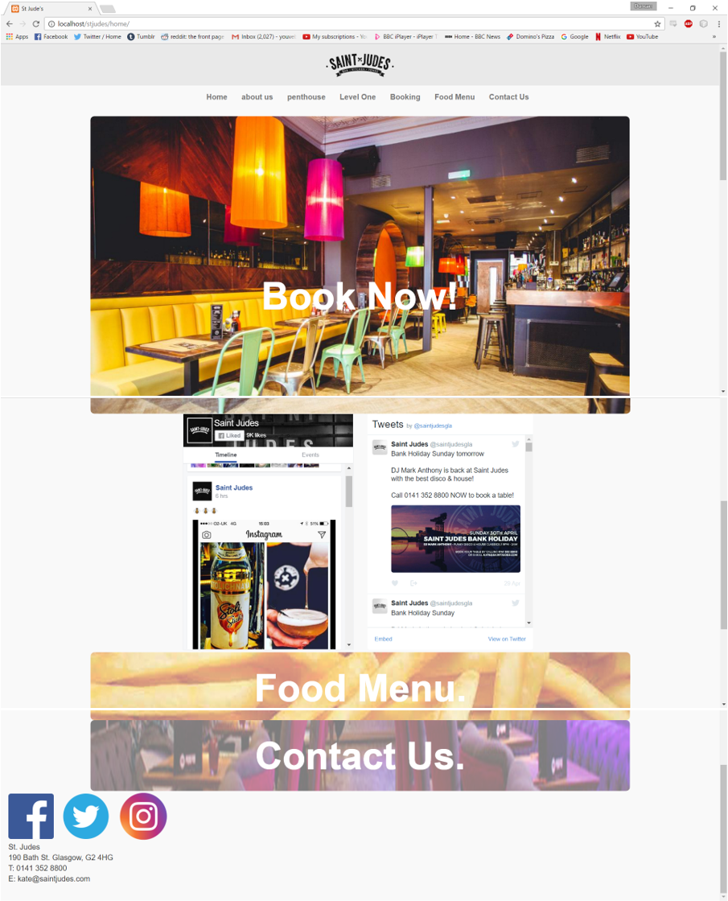
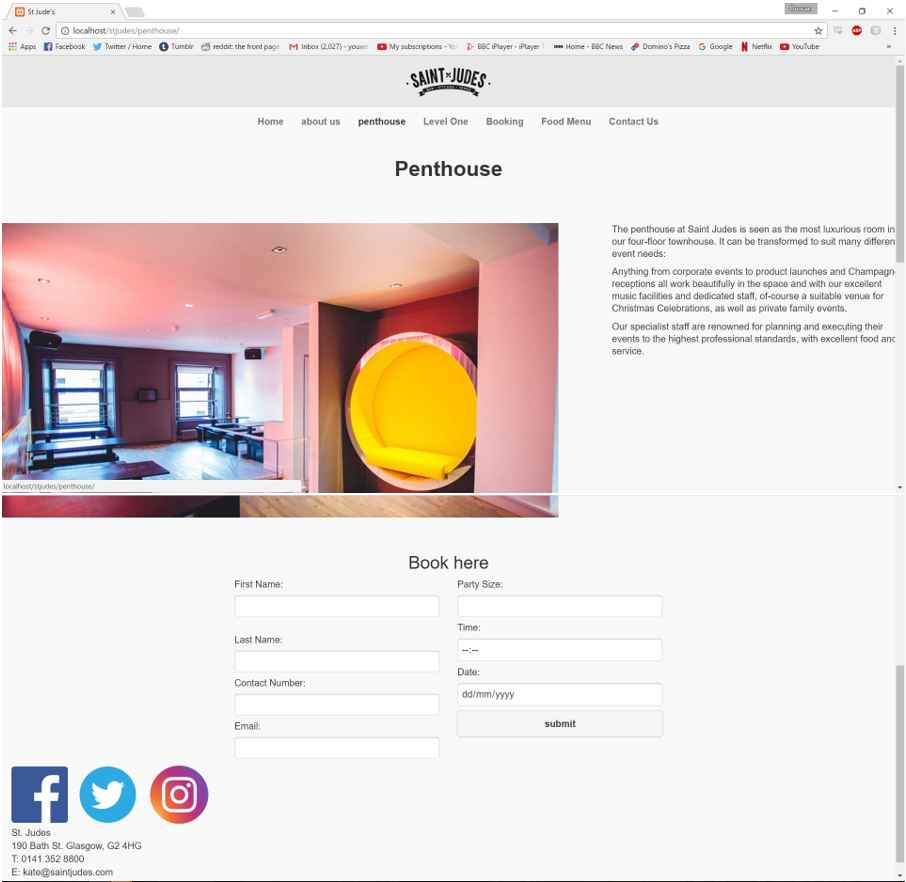
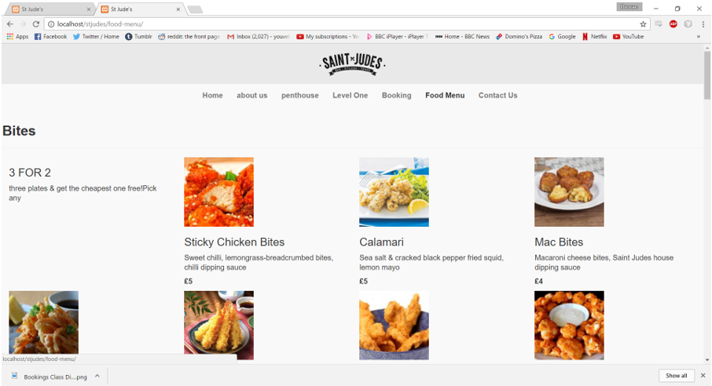
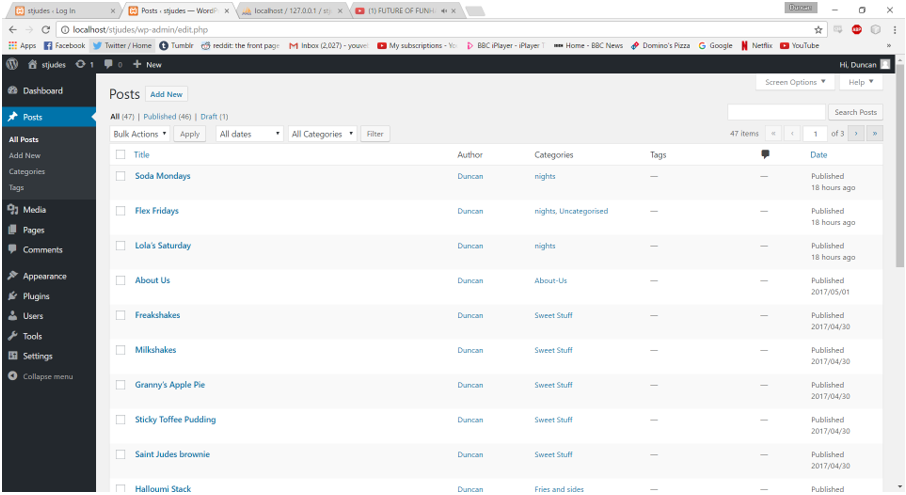
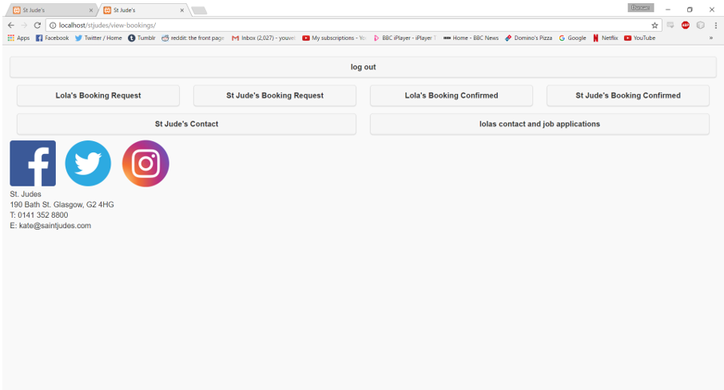

# St Judes Website

## About
This project was created for the final graded unit of our HND. We were encouraged to find a real client and create a piece of software for them that they could actually use. I was commisioned by the marketing manager of St Jude's to create a new website for the bar. He was not happy with the way social media was displayed and also complained that many customers stuggled to find the booking function of the current website as well, meaning he recieved alot more calls through out the day.

I created the website using a Wordpress backend. This also included using mysql and php. For the front end I also used bootstrap in conjunction with wordpress. The website featured social media feeds on the home page and a way to confirm and reply to bookings for the marketing manager. 

This site was unfortunately never used due to change in management

### Technology summary
* Wordpress
* Bootstrap
* PHP
* Javascript
* HTML5

## Homepage

  
The home page makes the booking fuction front and centre to allow customers to easily locate it. The social media feeds are are also featured as well as links to themin the footer.

## Booking

as well as a regular booking page, a booking input was added to the information pages as well. All of the information for these pages could be edited from the wordpress back end.

## Menu

I also redid the menu to add pictures of the food, this was a request from the marketing manager to entice customers with pictures of the food.

## Wordpress

To allow the manager more control over site information and pictures I used Wordpress backend to retrieve posts and pictures. This allowed the manager and easy gui to use to update information on the site.

## Admin View

I also added a page for the marketing manager to view bookings, delete and confirm them. They could also get the email of the people that booked and arrange further details with them.